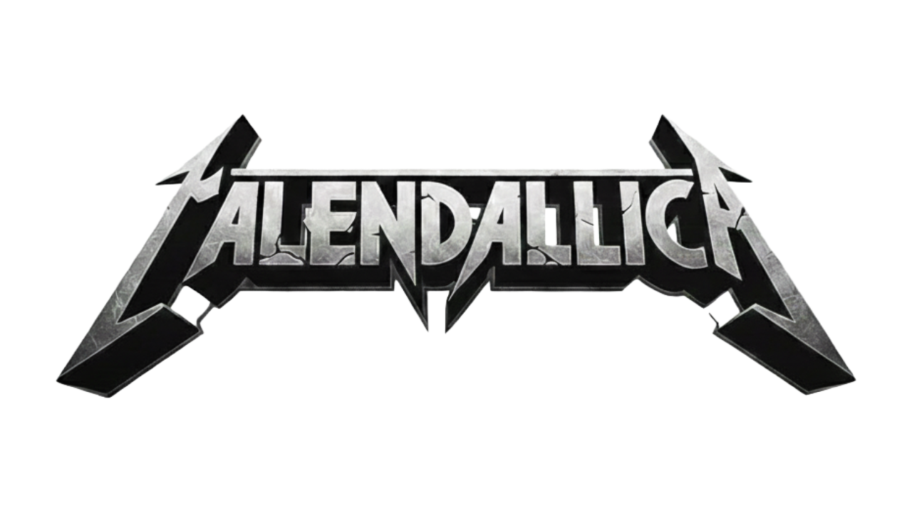

# Calendallica 📅

A minimalist, dark-themed interactive calendar application designed for simplicity and focus.

## 🌟 Features

-   **Interactive Calendar Grid**: Seamlessly navigate through months.
-   **Integrated Note-Taking**: meaningful interactions with a specific day to save notes directly to your browser's LocalStorage.
-   **Data Persistence**: Your notes are saved automatically and persist between sessions, specific to each month and day.
-   **Responsive Design**: Fully fluid layout that adapts gracefully from mobile devices to large desktop screens.
-   **Premium Aesthetic**: A polished "Stone" dark mode using modern UI principles.

## 🎨 Design & Credits

This project focuses on a clean, grid-based architecture.

> **Note**: A significant portion of the visual design aesthetic—visual styling, color palette (Stone Theme), typography, and component interactions (hover effects, shadows)—was crafted in collaboration with **Google Gemini**, ensuring a modern and premium look while strictly adhering to the user's structural grid layout requirements.

## 🛠️ Tech Stack

-   **HTML5**: Semantic structure.
-   **TailwindCSS v4**: Cutting-edge utility-first styling for rapid and beautiful UI development.
-   **Vanilla JavaScript**: Lightweight logic for calendar generation and state management without heavy frameworks.
-   **LocalStorage API**: For client-side data persistence.

## 🚀 Usage

1.  Clone the repository.
2.  Open `index.html` in any modern web browser.
3.  Or just open the Github Pages version!

---

*Enjoy organizing your time with Calendallica.*
